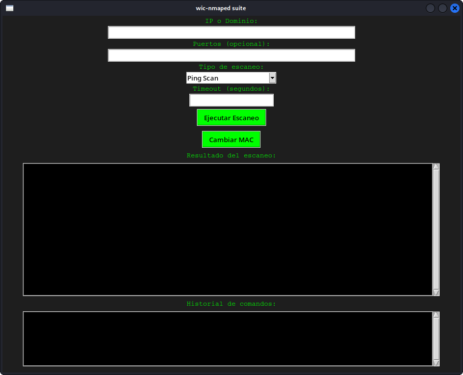

# wic-nmaped suite

**Interfaz gráfica multiplataforma para Nmap**, diseñada para usuarios que quieren escanear redes de forma rápida, visual e intuitiva. Ideal para pentesters, administradores de red o principiantes.



---

## 🧩 Funcionalidades

- Escaneo por IP, rango o dominio
- Selección de puertos manual o por defecto
- Modo Ping, Detección de servicios, Escaneo de vulnerabilidades
- Ajuste de timeout
- Historial de comandos ejecutados
- Botón para cambiar dirección MAC
- Interfaz oscura estilo hacker 😎
- Versión Linux (.deb) y próximamente Windows (.exe)

---

## 📦 Descargas

- [wic-nmaped-suite_1.0.deb](deb/wic-nmaped-suite_1.0.deb)
- `.exe` para Windows (próximamente)

---

## 🚀 Instalación en Kali Linux

```bash
sudo dpkg -i wic-nmaped-suite_1.0.deb
wic-nmaped
```

---

## 📋 Requisitos

- Python 3
- Tkinter → `sudo apt install python3-tk`
- Nmap → `sudo apt install nmap`
- Pillow → `pip install pillow`

---

## 💖 Apoya el proyecto

Si te ha resultado útil:

### Bitcoin (BTC)

[](bitcoin:3QpQQr6N25aL3xBoUVf21t4hpiVw2TG83N)

**Dirección BTC:**  
`3QpQQr6N25aL3xBoUVf21t4hpiVw2TG83N`

Escanea el QR si prefieres:


---

### PayPal

[](https://paypal.me/TU_USUARIO_PAYPAL)

© 2025 Wichu
